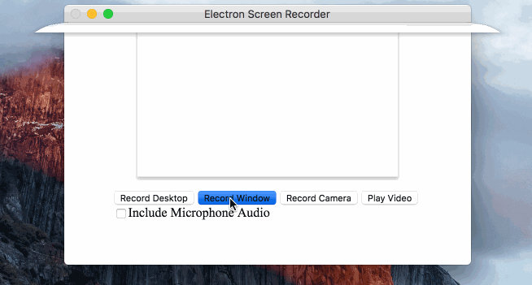

# Macau School Screen Recorder（學不停）

這是基於電腦屏幕記錄應用程序。 它使用WebRTC和
[`desktopCapture`](https://github.com/electron/electron/blob/master/docs/api/desktop-capturer.md#desktopcapturer) 用於音頻/視頻錄製的API。

您可以選擇特定的屏幕進行記錄，並保存記錄文件為`webm`。

## 使用方法

